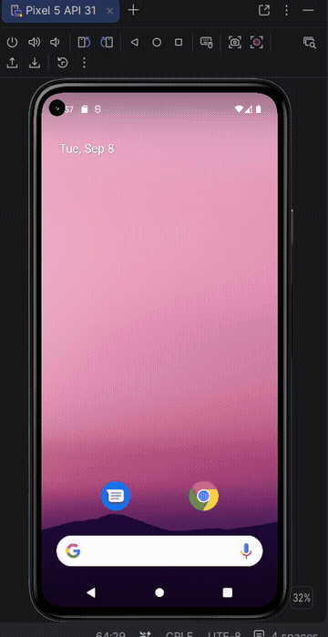

<!-- (This is a comment) INSTRUCTIONS: Go through this page and fill out any **bolded** entries with their correct values.-->

# AND101 Project 1 - Hello, Squirrel!

Submitted by: **Christian Ramirez**

Time spent: **3** hours spent in total

## Summary

**Android Hunt** is an android app that recreates the common "Hello, World!", to introduce ourselves to the neighborhood squirrel 🐿.  **Change or add to this description**

If I had to describe this project in three (3) emojis, they would be: **💻 ⛳ 🏖️**

## Application Features

<!-- (This is a comment) Please be sure to change the [ ] to [x] for any features you completed.  If a feature is not checked [x], you might miss the points for that item! -->

The following REQUIRED features are completed:

- [x] Change profile name to your name
- [x] Change profile bio text to a personal bio about yourself
- [x] Modify hobby section to include your top three (3) hobbies

The following STRETCH features are implemented:

- [ ] Re-brand the app by modifying the UI
- [x] Modify the profile image by uploading a new image drawable

The following EXTRA features are implemented:

- [ ] List anything else that you added to improve the app!

## Video Demo

Here's a video / GIF that demos all of the app's implemented features:

GIF created with **ScreentoGif**

<!-- Recommended tools:
- [Kap](https://getkap.co/) for macOS
- [ScreenToGif](https://www.screentogif.com/) for Windows
- [peek](https://github.com/phw/peek) for Linux. -->

## Notes

## Notes

I learned how to modify an Android layout using XML, use string resources, add an image drawable, and run an Android application using an emulator.
## License

Copyright **2026** **Christian Ramirez**

Licensed under the Apache License, Version 2.0 (the "License");
you may not use this file except in compliance with the License.
You may obtain a copy of the License at

    http://www.apache.org/licenses/LICENSE-2.0

Unless required by applicable law or agreed to in writing, software
distributed under the License is distributed on an "AS IS" BASIS,
WITHOUT WARRANTIES OR CONDITIONS OF ANY KIND, either express or implied.
See the License for the specific language governing permissions and
limitations under the License.